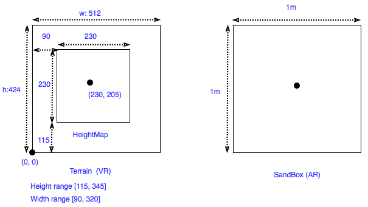

# VARClay-Client

## Introduction

## Usage

### Requirements
- Unity3D Version 2017.1.0f3
- Xcoce 9.2
- Deployed IOS Version 11.2
- iPhone 8 Plus

### Unity Assets
- [Photon Unity Networking Free](https://assetstore.unity.com/packages/tools/network/photon-unity-networking-free-1786)
- [Unity ARKit Plugin](https://assetstore.unity.com/packages/essentials/tutorial-projects/unity-arkit-plugin-92515)
- [VRTK](https://assetstore.unity.com/packages/tools/vrtk-virtual-reality-toolkit-vr-toolkit-64131)
- [Log Viewer](https://assetstore.unity.com/packages/tools/log-viewer-12047)


### Installation
#### Unity Setup
- Import `Photon Unity Networking`,
    - Set up AppID after import, and change Region to 'US' in `Assets/Photon Unity Networking/Resources/PhotonServerSettings`.
- Import `Unity ARKit Plugin`
- Import `VRTK`
- Import `Log Viewer`, For debug on mobile device purpose.
  - Create reporter from menu (Reporter->Create) at first scene game start.
  - Set the ” Scrip execution order ” in (Edit -> Project Settings ) of Reporter.cs to be the highest.

#### Xcode Setup


#### Xcode and Unity Integration
[Reference](https://github.com/jiulongw/swift-unity)
- Copy XcodePost

- Disable Metal API Validation. Go to Xcode->Product->Scheme->Edit Scheme, disable Metal API Validation. 


### Architecure


### VR AR Position Mapping

```
deltaX = 115;
deltaZ = 90;
VR_Position_X = AR_Position_X / (1 / 2) * 115 + deltaX;
VR_Position_Y = AR_Position_Y / (1 / 2) * 115 + deltaY;
```


